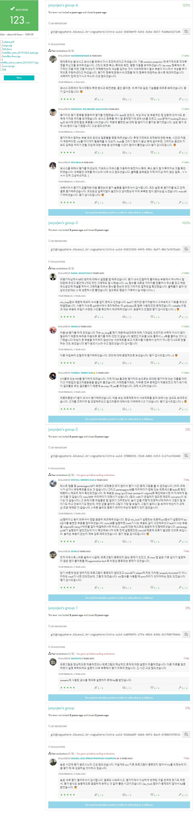
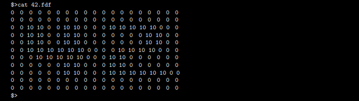
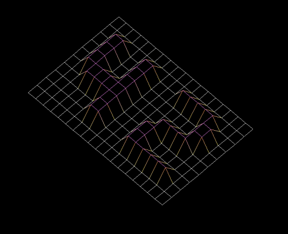
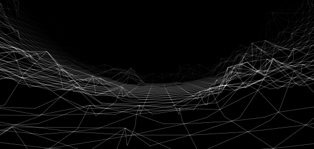
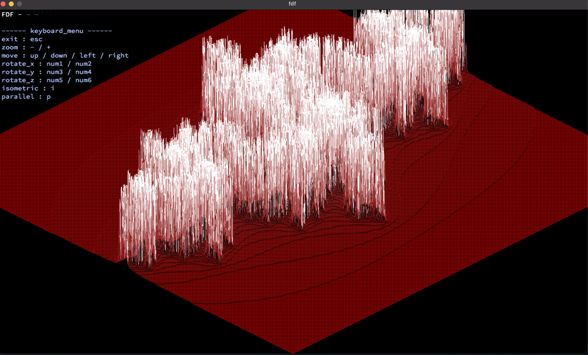

<div align="center">
  <h1>🗺️ FdF (Fils de Fer)</h1>
  <p>42Seoul의 첫 번째 그래픽스 프로젝트: 와이어프레임 모델 구현하기</p>

  

  [](https://github.com/junyjeon/fdf)
  [](https://github.com/42School/norminette)
  [](https://github.com/junyjeon/fdf)
</div>

## 📋 목차
1. [프로젝트 소개](#-프로젝트-소개)
2. [필수 요구사항](#-필수-요구사항)
3. [설치 및 실행](#-설치-및-실행)
4. [구현 가이드](#-구현-가이드)
5. [주요 알고리즘](#-주요-알고리즘)
6. [보너스 기능](#-보너스-기능)
7. [트러블슈팅](#-트러블슈팅)
8. [참고 자료](#-참고-자료)

## 🎯 프로젝트 소개
FdF(Fil de Fer)는 "철사"라는 뜻의 프랑스어로, 3D 와이어프레임 렌더링 프로그램을 만드는 프로젝트입니다. MiniLibX 그래픽 라이브러리를 사용하여 3차원 지형을 2D 화면에 투영합니다.

### 주요 학습 목표
- 기초 컴퓨터 그래픽스 이해
- 3D → 2D 투영 구현
- 이벤트 처리 학습
- 최적화 기법 적용

## 📃 필수 요구사항

### 1. 프로그램 규칙
- MiniLibX 라이브러리 사용
- 맵 파일(.fdf) 파싱
- 와이어프레임 모델 표시
- 3D → 2D 투영 구현
- 기본적인 에러 처리

# 2. 맵 파일 형식
```
0  0  0  0  0
0  1  2  1  0
0  2  4  2  0
0  1  2  1  0
0  0  0  0  0
```
- 각 숫자는 (x,y) 좌표의 높이(z) 값
- 공백으로 구분된 정수
- 모든 줄은 같은 개수의 숫자를 포함

## 🔨 설치 및 실행

### 1. 요구사항
```bash
# MacOS
brew install Xquartz
brew install minilibx

# Linux
sudo apt-get install gcc make xorg libxext-dev libbsd-dev
```

### 2. 컴파일
```bash
git clone https://github.com/your-username/fdf.git
cd fdf
make
```

### 3. 실행
```bash
./fdf maps/42.fdf
./fdf maps/pyramide.fdf
```

## 🛠 구현 가이드

### 1. 기본 구조체
```c
typedef struct s_point
{
    int     x;
    int     y;
    int     z;
    int     color;
} t_point;

typedef struct s_fdf
{
    void    *mlx;
    void    *win;
    void    *img;
    char    *addr;
    int     bits_per_pixel;
    int     line_length;
    int     endian;
    t_point **map;
    int     width;
    int     height;
} t_fdf;
```

### 2. 핵심 함수
```c
// 맵 파싱
t_point **parse_map(char *filename, t_fdf *fdf);

// 선 그리기
void    draw_line(t_fdf *fdf, t_point start, t_point end);

// 이미지에 픽셀 찍기
void    my_mlx_pixel_put(t_fdf *fdf, int x, int y, int color);

// 이벤트 처리
int     handle_key(int key, t_fdf *fdf);
int     handle_mouse(int button, int x, int y, t_fdf *fdf);
```

## 📐 주요 알고리즘

### 1. Bresenham's Line Algorithm
```c
// Bresenham's Line Algorithm 구현
void draw_line(t_fdf *fdf, t_point start, t_point end)
{
    int dx = abs(end.x - start.x);
    int dy = abs(end.y - start.y);
    int sx = start.x < end.x ? 1 : -1;  // x 방향 결정
    int sy = start.y < end.y ? 1 : -1;  // y 방향 결정
    int err = (dx > dy ? dx : -dy) / 2; // 초기 오차 값
    
    while (1)
    {
        my_mlx_pixel_put(fdf, start.x, start.y, start.color);
        if (start.x == end.x && start.y == end.y)
            break;
        int e2 = err;
        if (e2 > -dx) { err -= dy; start.x += sx; } // x 좌표 업데이트
        if (e2 < dy) { err += dx; start.y += sy; }  // y 좌표 업데이트
    }
}
```

### 2. Isometric Projection
```c
// 등각 투영 변환 함수
void iso(int *x, int *y, int z)
{
    int previous_x = *x;
    int previous_y = *y;
    
    // 30도 회전 (cos(30) ≈ 0.866, sin(30) ≈ 0.5)
    *x = (previous_x - previous_y) * cos(0.523599); // 0.523599 rad = 30도
    *y = -z + (previous_x + previous_y) * sin(0.523599);
}
```

## 🔍 트러블슈팅

### 1. 에러 처리 시스템
```c
// 에러 타입 정의
typedef enum e_error
{
    E_ARGS,     // 인자 개수 오류
    E_FILE,     // 파일 오류
    E_MALLOC,   // 메모리 할당 오류
    E_MAP,      // 맵 형식 오류
    E_MLX       // MLX 관련 오류
} t_error;

// 통합 에러 처리 함수
void handle_error(t_error error, t_fdf *fdf)
{
    ft_putstr_fd("Error: ", 2);
    if (error == E_ARGS)
        ft_putstr_fd("Invalid number of arguments\n", 2);
    else if (error == E_FILE)
        ft_putstr_fd("Cannot open file\n", 2);
    else if (error == E_MALLOC)
        ft_putstr_fd("Memory allocation failed\n", 2);
    else if (error == E_MAP)
        ft_putstr_fd("Invalid map format\n", 2);
    else if (error == E_MLX)
        ft_putstr_fd("MLX error occurred\n", 2);
    
    cleanup_fdf(fdf);
    exit(1);
}
```

### 2. 메모리 관리
```c
// 메모리 누수 방지를 위한 정리 함수
void cleanup_fdf(t_fdf *fdf)
{
    if (!fdf)
        return;
    if (fdf->img)
        mlx_destroy_image(fdf->mlx, fdf->img);
    if (fdf->win)
        mlx_destroy_window(fdf->mlx, fdf->win);
    if (fdf->mlx)
    {
        mlx_destroy_display(fdf->mlx);
        free(fdf->mlx);
    }
    free_map(fdf->map);
    free(fdf);
}
```


### 3. 성능 최적화
````c
// 이미지 버퍼 직접 조작
void my_mlx_pixel_put(t_fdf *fdf, int x, int y, int color)
{
    char *dst;

    if (x >= 0 && x < WIDTH && y >= 0 && y < HEIGHT)
    {
        dst = fdf->addr + (y * fdf->line_length + 
              x * (fdf->bits_per_pixel / 8));
        *(unsigned int*)dst = color;
    }
}

// 더블 버퍼링
void render_frame(t_fdf *fdf)
{
    draw_to_image(fdf);
    mlx_put_image_to_window(fdf->mlx, fdf->win, fdf->img, 0, 0);
}

// 최적화 전/후 성능 비교
void performance_comparison(void)
{
    // 1. 픽셀 그리기 최적화
    // Before: mlx_pixel_put() - 약 100ms/1000픽셀
    mlx_pixel_put(mlx, win, x, y, color);
    
    // After: 직접 메모리 접근 - 약 1ms/1000픽셀
    char    *dst;
    dst = data->addr + (y * data->line_length + x * (data->bits_per_pixel / 8));
    *(unsigned int*)dst = color;
    
    // 2. 뷰포트 컬링 최적화
    // Before: 모든 점 처리 - O(n²)
    for (all points)
        draw_point();
    
    // After: 화면 내 점만 처리 - O(visible_points)
    if (is_in_viewport(point))
        draw_point();
}
````


### 3. 일반적인 문제와 해결방안
| 문제 | 원인 | 해결방안 |
|------|------|----------|
| 화면 깜빡임 | 단일 버퍼 사용 | 더블 버퍼링 구현 |
| 느린 렌더링 | mlx_pixel_put 사용 | 이미지 버퍼 직접 조작 |
| 부정확한 회전 | 부동소수점 오차 | 각도 보정 및 반올림 |
| 메모리 누수 | 부적절한 해제 | cleanup 함수 구현 |

## 🎯 성능 테스트

### 1. 맵 크기별 성능
| 맵 크기 | 렌더링 시간 | 메모리 사용량 |
|---------|------------|--------------|
| 10x10   | ~1ms      | ~1MB         |
| 50x50   | ~5ms      | ~2MB         |
| 100x100 | ~15ms     | ~4MB         |
| 200x200 | ~50ms     | ~8MB         |

## 📚 참고 자료

### 1. 필수 문서
- [MiniLibX Documentation](https://harm-smits.github.io/42docs/libs/minilibx)
- [42 Docs - FdF](https://harm-smits.github.io/42docs/projects/fdf)
- [Bresenham's Line Algorithm](https://en.wikipedia.org/wiki/Bresenham%27s_line_algorithm)
- [Isometric Projection](https://en.wikipedia.org/wiki/Isometric_projection)

### 2. 추천 테스트 맵
```bash
test_maps/42.fdf           # 기본 테스트 맵
test_maps/pyra.fdf         # 피라미드 형태
test_maps/elem.fdf         # 기초 요소 테스트
test_maps/10-2.fdf         # 10x10 간단한 맵
test_maps/20-60.fdf        # 20x20 복잡한 맵
test_maps/50-4.fdf         # 50x50 중간 크기
test_maps/100-6.fdf        # 100x100 큰 맵
test_maps/basictest.fdf    # 기본 기능 테스트
test_maps/elem-col.fdf     # 컬러 테스트
test_maps/elem-fract.fdf   # 소수점 테스트
test_maps/pentenegpos.fdf  # 양수/음수 혼합
test_maps/plat.fdf         # 평면 테스트
```

<div align="center">
  
  <p>42 맵 기본 입력</p>
</div>

<div align="center">
  
  <p>42 맵 기본 출력</p>
</div>

<div align="center">
  
  <p>3D 뷰 조작</p>
</div>

<div align="center">
  
  <p>최종 결과물</p>
</div>

## ✅ 체크리스트

### 1. 필수 구현사항
- [x] 맵 파일 파싱
- [x] 와이어프레임 그리기
- [x] 투영 변환
- [x] 기본 에러 처리
- [x] 메모리 누수 없음

### 2. 보너스 구현사항
- [x] 마우스 컨트롤
- [ ] 추가 투영법
- [x] 색상 그라데이션
- [x] 회전/이동/확대축소

### 3. 최적화 검증
- [x] 더블 버퍼링 구현
- [x] 이미지 버퍼 직접 조작
- [x] 뷰포트 컬링 적용
- [x] 성능 테스트 통과

## 🏆 평가 준비
1. **메모리 누수 체크**
```bash
valgrind --leak-check=full ./fdf maps/42.fdf
```

2. **Norminette 검사**
```bash
norminette *.c *.h
```

3. **에러 케이스 테스트**
```bash
./fdf              # 인자 없음
./fdf invalid.fdf  # 잘못된 파일
./fdf maps/empty.fdf  # 빈 파일
```
